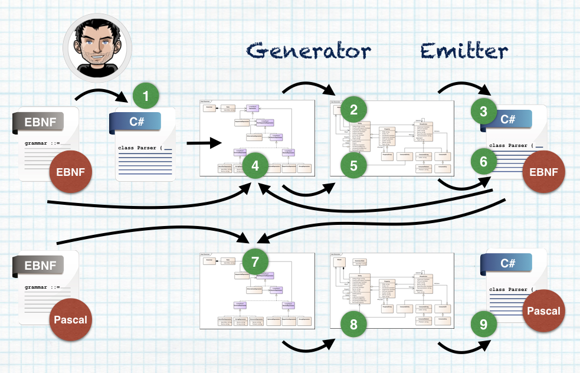

# Human Parser Generator

A simple Parser Generator with a focus on "human" code generation    
Christophe VG (<contact@christophe.vg>)  
[https://github.com/christophevg/cs-parser-generator](https://github.com/christophevg/cs-parser-generator)

# Introduction

Although many parser generators exist, I feel like there is room for one more, which generates a parser in a more "human" way.

The objectives are:

* start from an EBNF-like notation, e.g. allow copy pasting existing grammars and (maybe almost) be done with it.
* generate code, as if it were written by a human developer:
	* generate functional classes to construct the AST
	* generate parser logic that is readable and understandable
* be self hosting: the project should be able to generate itself.

The project will initially target C#. No other target language is planned at this point.

**Disclaimer** I'm not aiming for feature completeness and only add support for what I need at a given time ;-)

## Current status

* A trivial example of a small subset of the Pascal language can be parsed.
* The generator is capable of generating a parser for its own EBNF-like definition language, which means its self-hosting (see also below for more information on this feature). 
* A parser for a more complex grammar for Cobol record definitions (aka Copybooks) is capable of (roughly) parsing a set of example Copybooks.

## Example

The following example is taken from [the Wikipedia page on EBNF](https://en.wikipedia.org/wiki/Extended_Backus–Naur_form):

```ebnf
(* a simple program syntax in EBNF − Wikipedia *)
 program = 'PROGRAM', white space, identifier, white space, 
            'BEGIN', white space, 
            { assignment, ";", white space }, 
            'END.' ;
 identifier = alphabetic character, { alphabetic character | digit } ;
 number = [ "-" ], digit, { digit } ;
 string = '"' , { all characters - '"' }, '"' ;
 assignment = identifier , ":=" , ( number | identifier | string ) ;
 alphabetic character = "A" | "B" | "C" | "D" | "E" | "F" | "G"
                      | "H" | "I" | "J" | "K" | "L" | "M" | "N"
                      | "O" | "P" | "Q" | "R" | "S" | "T" | "U"
                      | "V" | "W" | "X" | "Y" | "Z" ;
 digit = "0" | "1" | "2" | "3" | "4" | "5" | "6" | "7" | "8" | "9" ;
 white space = ? white space characters ? ;
 all characters = ? all visible characters ? ;
```

This grammar would allow to parse

```pascal
 PROGRAM DEMO1
 BEGIN
   A:=3;
   B:=45;
   H:=-100023;
   C:=A;
   D123:=B34A;
   BABOON:=GIRAFFE;
   TEXT:="Hello world!";
 END.
```

### Changes, Simplifications, Extensions,...

To get a head-start I've added few changes/extensions/limitations to the standard EBNF notation. The following grammar is a rewritten version of the earlier Pascal example, using these extensions:

```ebnf
program               ::= "PROGRAM" identifier
                          "BEGIN"
                          { assignment }
                          "END."
                        ;

assignment            ::= identifier ":=" expression ";" ;

expression            ::= identifier
                        | string
                        | number
                        ;

identifier            ::= name  @ /([A-Z][A-Z0-9]*)/ ;
string                ::= text  @ /"([^"]*)"|'([^']*)'/ ;
number                ::= value @ /(-?[1-9][0-9]*)/ ;
```

The extensions that are applied are:

* abandoned `,` (colon) in sequences of consecutive expressions
* spaces in rule names (left hand side) are not allowed (e.g. use dashes)
* ignoring whitespace, removing the need for explicit whitespace description
* definition of "extracting terminals" using regular expressions
* introduction of implicit "virtual" entities, which don't show up in the AST (`expression` is an example)

### Demos

A few demos show the capabilities and results of the generated parsers.

#### Pascal

In the `example/` folder I've started by writing a manual implementation (`parser.cs`), taking into account how I think this could be generated. The output of the example program, parses the example Pascal file and outputs an AST-like structure:

```bash
$ cd example/pascal

$ make
Program(Identifier=Identifier(Name=DEMO1),Assignments=[Assignment(Identifier=Identifier(Name=A),Expression=Number(Value=3)),Assignment(Identifier=Identifier(Name=B),Expression=Number(Value=45)),Assignment(Identifier=Identifier(Name=H),Expression=Number(Value=-100023)),Assignment(Identifier=Identifier(Name=C),Expression=Identifier(Name=A)),Assignment(Identifier=Identifier(Name=D123),Expression=Identifier(Name=B34A)),Assignment(Identifier=Identifier(Name=BABOON),Expression=Identifier(Name=GIRAFFE)),Assignment(Identifier=Identifier(Name=TEXT),Expression=String(Text=Hello world!))])
```

In the `generator/` folder a (still rough around the edges) implementation of the generator is able to generate the same parser.

The Makefile implements a complete demo that first generates the parser, compares it to the manual version (not taking into account whitespace changes ;-) ) and then copies the other files from the demo (`parsable.cs`, which contains a helper class to deal with basic parsing operation, `main.cs`, the same runner, `example.pascal`, the Pascal source code and `Makefile`, to compile and run the parser).

```bash
$ cd generator/

$ make
*** building second generation generator/parser
*** generating parser
*** generating parser from bootstrap to generation/parser.cs
*** setting up generator environment
*** generating parser
*** generating parser from grammars/hpg.bnf to generation/parser.cs
*** setting up generator environment
*** generating parser from grammars/pascal-assignments.bnf to ../../demo/parser.cs
*** comparing to manual version
*** setting up runtime environment for parser
*** running example with generated parser
Program(Identifier=Identifier(Name=DEMO1),Assignments=[Assignment(Identifier=Identifier(Name=A),Expression=Number(Value=3)),Assignment(Identifier=Identifier(Name=B),Expression=Number(Value=45)),Assignment(Identifier=Identifier(Name=H),Expression=Number(Value=-100023)),Assignment(Identifier=Identifier(Name=C),Expression=Identifier(Name=A)),Assignment(Identifier=Identifier(Name=D123),Expression=Identifier(Name=B34A)),Assignment(Identifier=Identifier(Name=BABOON),Expression=Identifier(Name=GIRAFFE)),Assignment(Identifier=Identifier(Name=TEXT),Expression=String(Text=Hello world!))])

$ ls demo
Makefile	dump-ast.cs	example.pas	parsable.cs	parser.cs
```

## Being Self Hosting

An important aspect of this project is being self hosting and parsing the EBNF-like grammars with a parser that is generated by the parser generator itself. The following diagram shows what I mean by this; it shows the 9 steps to get from *no parser* to a fully generated/generation 2 EBNF-like parser, that can be used to generate a parser for a different languag, e.g. Pascal:



1. Human encoding of EBNF to loadable C# code
2. Importing of the Grammar and transformation to a Parser model
3. Emission of Generation 1 EBNF Parser
4. Using Generation 1 Parser, parsing of EBNF definition into Grammar parse tree
5. Importing of the Grammar and transformation to a Parser model
6. Emission of Generation 2 EBNF Parser
7. Using Generation 2 Parser, parsing of Pascal definition into Grammar parse tree
8. Importing of the Grammar and transformation to a Parser model
9. Emission of Pascal Parser

### Grammar

The grammar for the Human Parser Generator BNF-like notation (currently) looks like this:

```ebnf
grammar                   ::= { rule } ;

rule                      ::= identifier "::=" expression ";" ;

expression                ::= sequential-expression
                            | non-sequential-expression
                            ;

sequential-expression     ::= non-sequential-expression expression ;

non-sequential-expression ::= alternatives-expression
                            | atomic-expression
                            ;

alternatives-expression   ::= atomic-expression "|" non-sequential-expression ;


atomic-expression         ::= nested-expression
                            | terminal-expression
                            ;

nested-expression         ::= optional-expression
                            | repetition-expression
                            | group-expression
                            ;

optional-expression       ::= "[" expression "]" ;
repetition-expression     ::= "{" expression "}" ;
group-expression          ::= "(" expression ")" ;

terminal-expression       ::= identifier-expression
                            | string-expression
                            | extractor-expression
                            ;

identifier-expression     ::= identifier ;
string-expression         ::= string ;

extractor-expression      ::= "/" regex "/" ;

identifier                ::= /([A-Za-z][A-Za-z0-9-]*)/ ;
string                    ::= /"([^"]*)"|^'([^']*)'/ ;
regex                     ::= /(.*?)(?<keep>/\s*;)/ ;
```

To bootstrap the generator, to allow it to generate a parser for the EBNF-like definition language, a grammar modelled by hand is used. It is located in `generator/grammar.cs` in the `AsModel` class, retrievable via the `BNF` property.

The model is a direct implementation of this EBNF-like definition in object-oriented structures and looks like this:


Not shown in the model are `identifier`, `string` and `regex`. These lowest-level, extracting entities, are not generated as classes, but as (static) prepared regular expressions, and used when needed.

### Generator

The generator accepts a Grammar Model, which is basically an Abstract Syntax Tree (AST), and first transforms this, to a Parser Model. This model is a rewritten version of the Grammar Model and is designed to facilitate the emission of the actual Parser code.

The structure of the Generator (currently) looks like this:


### Test Driven Development

To be able to focus on sub-problems and isolate combinations of constructs, I've set up a unit testing infrastructure that generates a EBNF-like parser and then uses that to run the tests:

```bash
$ make
*** generating parser generator, including EBNF-like parser
*** building second generation generator/parser
*** generating parser
*** generating parser from bootstrap to generation/parser.cs
*** setting up generator environment
*** generating parser
*** generating parser from grammars/hpg.bnf to generation/parser.cs
*** setting up generator environment
*** building unit tests
*** executing unit tests
.......................
Tests run: 23, Failures: 0, Not run: 0, Time: 0.191 seconds
```

> The unit tests hardly cover the basics of the source tree, but the goal is to have a comprehensive set, covering all possibilities. The unit tests will be the driving force for the continued development :-)

### Cobol Example

In `examples/cobol` the HPG is used to generate a parser for Cobol record definitions, also known as Copybooks - Warning: this is work in progress. The generated parser is currently capable of parsing several example Copybooks, but needs some EBNF-like definition rewriting to get the full potential. A few unit tests are the beginning to get this in motion:

```bash
$ make
*** generating parser generator, including EBNF-like parser
*** building second generation generator/parser
*** generating parser
*** generating parser from bootstrap to generation/parser.cs
*** setting up generator environment
*** generating parser
*** generating parser from grammars/hpg.bnf to generation/parser.cs
*** setting up generator environment
*** generating parser from grammars/cobol-record-definition.bnf to ../../../example/cobol/parser.cs
~~~ C# Emitter Warning: rewriting property name: subset
~~~ C# Emitter Warning: rewriting property name: subset
~~~ C# Emitter Warning: rewriting property name: float
~~~ C# Emitter Warning: rewriting property name: float
~~~ C# Emitter Warning: rewriting property name: string
~~~ C# Emitter Warning: rewriting property name: string
~~~ C# Emitter Warning: rewriting property name: subset
~~~ C# Emitter Warning: rewriting property name: float
~~~ C# Emitter Warning: rewriting property name: string
*** building unit tests
*** executing unit tests
..
Tests run: 2, Failures: 0, Not run: 0, Time: 0.099 seconds
```
